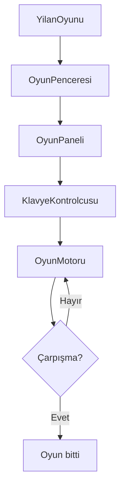

# Snake Game

Java 21 ve Swing ile geliştirilmiş, tek oyunculu klasik bir yılan oyunudur. Yılan yemleri ve güçlendirmeleri toplar; duvara, kendi gövdesine veya mayınlara çarptığında oyun sona erer.

## Özellikler

- Ok tuşları veya WASD ile kontrol
- Normal yem: `+10` puan ve yılanın büyümesi
- Altın coin: `+50` puan
- Buz güçlendirmesi ve skora bağlı hız artışı
- Mayınlar, çarpışma kontrolü ve oyun sonu ekranı
- Duraklatma/devam ettirme (`P` veya `ESC`)
- Yeniden başlatma butonu ve yerel en yüksek skor kaydı
- Başlangıç ekranı, animasyonlar ve arka plan müziği

## Ekran Görüntüsü

<p align="center">
  
  
  
</p>

[Oynanış animasyonunu görüntüle](assets/02-gameplay-demo.gif)

## Mimari

Proje, oyun mantığı, veri modelleri ve Swing arayüzü ayrılmış katmanlı ve MVC benzeri bir yapı kullanır.

- `yilanoyunu.YilanOyunu`: Uygulamanın giriş noktası
- `engine.OyunMotoru`: Hareket, skor, yem/güçlendirme ve çarpışma kuralları
- `model`: Konum, yön, oyun durumu ve güçlendirme veri modelleri
- `ui.OyunPaneli`: Oyun alanının çizimi, timer'lar ve oyun ekranları
- `ui.KlavyeKontrolcusu`: Klavye girişleri
- `ui.SesOynatici`: Arka plan müziği

Oyun akışı kısaca şöyledir:



## Proje Yapısı

```text
SnakeGame/
├── pom.xml
├── build.ps1
├── package.ps1
├── assets/
└── src/
    ├── main/
    │   ├── java/yilanoyunu/
    │   │   ├── YilanOyunu.java
    │   │   ├── engine/
    │   │   ├── model/
    │   │   └── ui/
    │   └── resources/
    └── test/java/yilanoyunu/engine/
```

Derleme ve IDE çıktıları (`target/`, `dist/`, `.idea/` vb.) `.gitignore` ile repository dışında tutulur.

## Gereksinimler

- Kaynak koddan çalıştırmak için JDK 21 veya üzeri
- Windows, Linux veya macOS üzerinde Java 21 ile kaynak koddan çalıştırılabilir
- IDE zorunlu değildir; proje Maven yapısındadır
- Üretim kodunda harici runtime kütüphanesi yoktur; Swing ve Java Sound JDK ile gelir

## Kurulum ve Çalıştırma

### Kaynak koddan

```powershell
git clone https://github.com/emirkvrak/SnakeGame.git
cd SnakeGame
.\build.ps1
java -cp target/classes yilanoyunu.YilanOyunu
```

Alternatif olarak `pom.xml` dosyasını kullanan herhangi bir Java IDE'siyle projeyi açıp `yilanoyunu.YilanOyunu` sınıfını çalıştırabilirsiniz. Maven kuruluysa:

```powershell
mvn compile exec:java
```

### Java kurmadan Windows'ta oynama

[](https://github.com/emirkvrak/SnakeGame/releases/latest/download/SnakeGame-portable.zip)

ZIP dosyasını indirip çıkardıktan sonra `SnakeGame/SnakeGame.exe` dosyasını çalıştırın. Java kurulması gerekmez.

## Kontroller

| Tuş | İşlev |
|---|---|
| `↑` / `W` | Yukarı |
| `↓` / `S` | Aşağı |
| `←` / `A` | Sola |
| `→` / `D` | Sağa |
| `P` / `ESC` | Duraklat / devam ettir |
| `YENİDEN BAŞLAT` | Oyun bittiğinde yeni oyun |

## Test

Oyun motoru için JUnit 5 testleri bulunur:

```powershell
mvn test
```

Arayüz için otomatik test yoktur. Manuel olarak başlangıç ekranı, hareket, yem/puan, güçlendirmeler, çarpışma, duraklatma, müzik ve yeniden başlatma kontrol edilebilir.

## Paketleme

JDK 21 bulunan geliştirici bilgisayarında:

```powershell
.\package.ps1
```

Bu komut Windows için Java runtime içeren taşınabilir uygulamayı ve `dist/SnakeGame-portable.zip` dosyasını oluşturur. Güncel paket GitHub Releases bölümünde yayımlanır.

## Sınırlamalar

- Tek oyunculu bir masaüstü uygulamasıdır.
- Online multiplayer, veritabanı ve çevrimiçi skor tablosu yoktur.
- Linux ve macOS için paketlenmiş sürüm bulunmamaktadır.
- Swing arayüzü için otomatik test kapsamı yoktur.

## Proje Durumu

Üniversitenin erken döneminde hazırlanmış eğitim amaçlı Java projesi modernize edilmiştir. Mevcut sürüm, oynanabilir Windows taşınabilir paketiyle sunulmaktadır.

## Lisans

Bu repository için henüz açık kaynak lisansı belirtilmemiştir.
