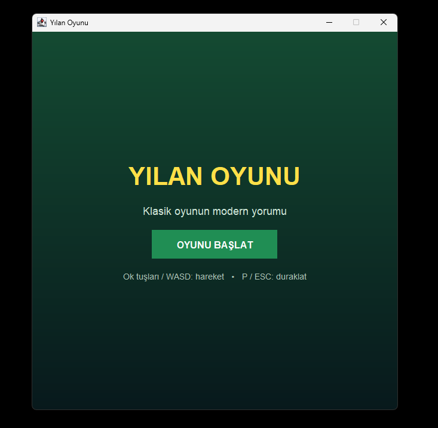
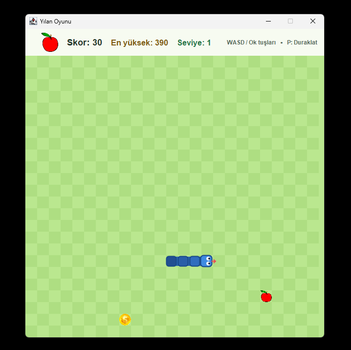
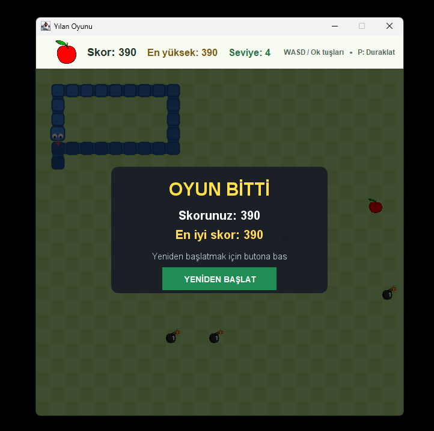
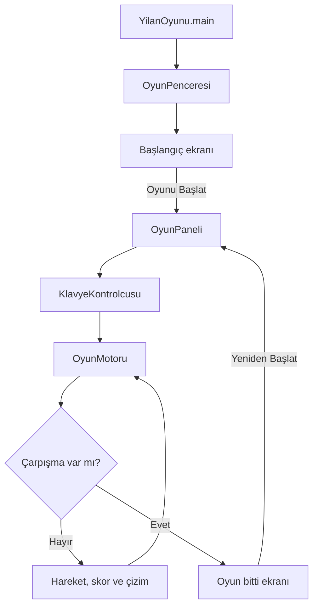

# Snake Game

Java 21 ve Swing ile geliştirilmiş, masaüstünde çalışan klasik bir yılan oyunudur. Oyuncu, yılanı bir ızgara üzerinde hareket ettirerek yemleri toplar; yılan büyür, skor kazanır ve duvara, kendi gövdesine veya mayınlara çarptığında oyun sona erer.

## Özellikler

- Ok tuşları ve WASD ile oyuncu hareketi
- Normal yem ile büyüme ve `+10` skor
- Altın coin ile `+50` skor
- Skora bağlı kontrollü hız artışı
- Geçici yavaşlatma sağlayan buz güçlendirmesi
- Skor arttıkça mayınların ortaya çıkması
- Duvara, kendi gövdesine veya mayına çarpma kontrolü
- Oyun bitti ekranı
- Oyun bittiğinde yeniden başlatma butonu
- `P` veya `ESC` ile duraklatma/devam ettirme
- Bilgisayarda saklanan en yüksek skor
- Başlangıç ekranı, puan animasyonu ve ölüm efekti
- Arka plan müziği

## Ekran Görüntüsü








## Mimari

Proje, katmanlı ve MVC benzeri bir yapı kullanır. Bu, katı bir MVC framework'ü değildir; oyun kuralları, veri modelleri ve Swing arayüzü ayrı paketlerde tutulur.

### Ana giriş sınıfı

`yilanoyunu.YilanOyunu`, uygulamayı Swing Event Dispatch Thread üzerinde başlatır ve `yilanoyunu.ui.OyunPenceresi` sınıfını oluşturur.

### Oyun döngüsü

`yilanoyunu.ui.OyunPaneli` iki Swing timer kullanır:

- `hareketTimer`: Oyun motorunu ilerletir. Başlangıç hareket aralığı `OyunAyarlari` içindeki değerden gelir ve skor/güçlendirmelere göre değişebilir.
- `cizimTimer`: Ekranın yeniden çizilmesini sağlar ve hareketler arasındaki görsel interpolasyonu günceller.

### Klavye kontrolleri

Klavye eşlemeleri `yilanoyunu.ui.KlavyeKontrolcusu` içinde Swing Key Bindings ile tanımlanır. Yön değişiklikleri `OyunMotoru` içindeki güvenli yön kuyruğuna aktarılır.

### Yılan hareketi ve çarpışma

`yilanoyunu.engine.OyunMotoru` yılanın konumlarını, yönünü, yemini, engellerini, güçlendirmelerini ve oyun durumunu yönetir.

- `model.Konum`: Izgara koordinatını temsil eder.
- `model.Yon`: Dört hareket yönünü ve ters yön kontrolünü tanımlar.
- `OyunMotoru.ilerle()`: Yılanı bir adım ilerletir, yem/güçlendirme toplamayı ve çarpışmaları kontrol eder.
- Duvar çarpışması, `duvaraCarpti` metodu ile kontrol edilir.
- Kendine ve mayına çarpma, yeni kafa konumunun mevcut yılan/engel konumlarıyla karşılaştırılmasıyla kontrol edilir.

### Yem, güçlendirme ve skor

`OyunMotoru` normal yem toplandığında yılanı büyütür ve skoru `10` artırır. `model.Guc` ve `model.GucTuru` altın coin ile buz güçlendirmelerini temsil eder. En yüksek skor, `ui.SkorKaydi` tarafından Java `Preferences` API'si ile yerel kullanıcı ayarlarında saklanır.

### Ekran çizimi ve kaynaklar

`ui.OyunPaneli` oyun tahtasını, yılanı, yemleri, mayınları, güçlendirmeleri, animasyonları ve oyun sonu/duraklatma ekranlarını çizer. `yilanoyunu.Kaynaklar`, görsel ve ses dosyalarını classpath üzerinden yükler; kaynaklar JAR veya paketlenmiş uygulama içinde de kullanılabilir.

### Oyun akışı



## Proje Yapısı

```text
SnakeGame/
├── pom.xml
├── README.md
├── build.ps1
├── package.ps1
├── assets/
│   ├── 01-main-menu.png
│   ├── 02-gameplay-demo.gif
│   ├── 03-gameplay.png
│   └── 04-game-over.png
└── src/
    ├── main/
    │   ├── java/yilanoyunu/
    │   │   ├── YilanOyunu.java
    │   │   ├── Kaynaklar.java
    │   │   ├── engine/OyunMotoru.java
    │   │   ├── model/
    │   │   └── ui/
    │   └── resources/
    │       ├── altin-coin.png
    │       ├── background-music.wav
    │       ├── bomba.png
    │       └── elma.png
    └── test/
        └── java/yilanoyunu/engine/OyunMotoruTest.java
```

`target/`, `dist/`, `.idea/` ve diğer IDE/derleme çıktıları `.gitignore` tarafından dışarıda tutulur.

## Gereksinimler

- JDK 21 veya üzeri
- Windows, Linux veya macOS üzerinde Java 21 ile kaynak koddan çalıştırılabilir; diğer işletim sistemlerinde ayrıca doğrulama yapılmamıştır.
- IDE zorunlu değildir. IntelliJ IDEA, Apache NetBeans veya başka bir Java IDE'si kullanılabilir.
- Üretim kodunda harici runtime kütüphanesi yoktur; Swing, Java Sound ve Java Preferences JDK API'leridir.
- Maven, derleme/test eklentilerini ve JUnit test bağımlılığını yönetir.

## Kurulum

### JDK kurulumu

Windows üzerinde Eclipse Temurin JDK 21 kurulabilir:

```powershell
winget install --id EclipseAdoptium.Temurin.21.JDK -e --source winget
```

Kurulumu kontrol edin:

```powershell
java -version
javac -version
```

### Repository'yi klonlama

```powershell
git clone https://github.com/emirkvrak/SnakeGame.git
cd SnakeGame
```

## Çalıştırma

### IntelliJ IDEA

1. Projeyi açın veya doğrudan `pom.xml` dosyasını IntelliJ IDEA ile açın.
2. Maven projesinin yüklenmesini bekleyin.
3. Proje JDK'sı olarak Java 21'i seçin.
4. `src/main/java/yilanoyunu/YilanOyunu.java` dosyasını çalıştırın.

### Apache NetBeans

Bu repository artık eski NetBeans `nbproject` metadata'sını kullanmaz; Maven projesidir.

1. NetBeans'i JDK 21 ile açın.
2. `File > Open Project` veya `File > Open Project from POM` seçeneğini kullanın.
3. Repository içindeki `pom.xml` dosyasını seçin.
4. `yilanoyunu.YilanOyunu` sınıfını ana sınıf olarak çalıştırın.

### PowerShell ile derleme ve çalıştırma

```powershell
.\build.ps1
java -cp target/classes yilanoyunu.YilanOyunu
```

### Maven ile çalıştırma

```powershell
mvn compile exec:java
```

## Kontroller

| Tuş | İşlev |
|---|---|
| `↑` / `W` | Yukarı hareket |
| `↓` / `S` | Aşağı hareket |
| `←` / `A` | Sola hareket |
| `→` / `D` | Sağa hareket |
| `P` / `ESC` | Duraklatma veya devam etme |
| `YENİDEN BAŞLAT` | Oyun bittiğinde yeni oyun başlatma |

## Test

Oyun motoru için JUnit 5 testleri bulunmaktadır. Maven kuruluysa:

```powershell
mvn test
```

Testler yön değişikliği, ters yöne dönme engeli, hareket, başlangıç durumu ve yeniden başlatma davranışlarını kontrol eder. Swing arayüzü için otomatik UI testi bulunmamaktadır.

Manuel kontrol listesi:

- Başlangıç ekranı açılıyor mu?
- Oyun başlatılabiliyor mu?
- Yılan hareket ediyor mu?
- Yem yenince yılan büyüyor ve skor artıyor mu?
- Altın coin daha yüksek skor veriyor mu?
- Duvara çarpınca oyun bitiyor mu?
- Kendine veya mayına çarpınca oyun bitiyor mu?
- Duraklatma çalışıyor mu?
- Yeniden başlatma çalışıyor mu?
- Müzik çalıyor mu?

## Windows Paketi

Java kurmadan çalışacak Windows paketi GitHub Release olarak yayımlanmıştır:

[](https://github.com/emirkvrak/SnakeGame/releases/latest/download/SnakeGame-portable.zip)

[Snake Game v1.0.0 Release](https://github.com/emirkvrak/SnakeGame/releases/tag/v1.0.0)

Geliştirici makinesinde yeniden paketlemek için JDK 21 ile:

```powershell
.\package.ps1
```

Bu komut şunları oluşturur:

- `dist/SnakeGame/`: Java runtime içeren taşınabilir uygulama klasörü
- `dist/SnakeGame-portable.zip`: Son kullanıcıya gönderilecek ZIP
- `dist/SnakeGame.jar`: Java 21 gerektiren geliştirici JAR'ı

Son kullanıcı ZIP'i çıkardıktan sonra `SnakeGame/SnakeGame.exe` dosyasını çalıştırır. Java kurulması gerekmez.

## Sonuçlar

Proje; başlangıç ekranı, klavye ile yılan kontrolü, yem ve güçlendirmeler, skor, çarpışma kontrolü, duraklatma, oyun sonu ve yeniden başlatma akışını sağlar. Oyun motoru için temel otomatik testler bulunmaktadır; Swing arayüzü manuel olarak kontrol edilmelidir.

Bu proje için performans benchmarkı bulunmamaktadır.

## Sınırlamalar

- Tek oyunculu masaüstü uygulamasıdır.
- Online multiplayer desteği yoktur.
- Veritabanı veya çevrimiçi skor tablosu bulunmamaktadır.
- Kaynak koddan çalıştırmak için JDK 21 gerekir.
- Windows taşınabilir paketi hazırlanmıştır; Linux ve macOS paketleri ayrıca oluşturulmamıştır.
- Swing arayüzü için otomatik test kapsamı bulunmamaktadır.

## Proje Durumu

Proje, üniversitenin erken döneminde hazırlanmış eğitim amaçlı bir Java projesinden geliştirilmiştir. Kaynak kodu ve oyun yapısı modernize edilmiş, Windows için `v1.0.0` taşınabilir sürümü yayımlanmıştır. Yeni özellik geliştirme durumu ayrıca belirtilmemiştir.

## Lisans

Bu repository için henüz açık kaynak lisansı belirtilmemiştir.
