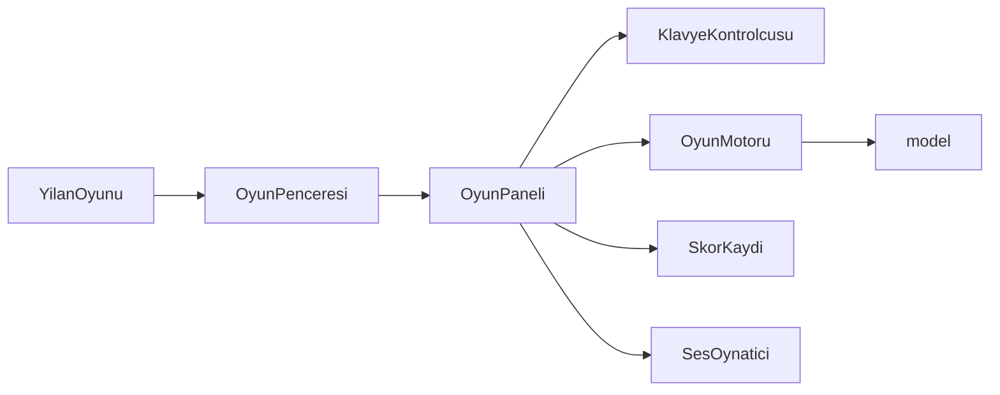

# Snake Game


[](https://github.com/emirkvrak/SnakeGame/actions/workflows/tests.yml)

Java Swing ile geliştirilmiş; yemleri ve güçlendirmeleri toplarken duvarlardan, kendi gövdenizden ve mayınlardan kaçtığınız tek oyunculu bir yılan oyunudur.

Bu proje, Kütahya Dumlupınar Üniversitesi Bilgisayar Mühendisliği bölümünde 1. sınıf uygulama ödevi olarak hazırlanmıştır. Daha sonra kaynak kodu, arayüzü, testleri ve Windows paketleme süreci geliştirilerek güncellenmiştir.

[**Windows için SnakeGame-portable.zip dosyasını indirin**](https://github.com/emirkvrak/SnakeGame/releases/download/v1.0.2/SnakeGame-portable.zip)

ZIP dosyasını çıkarıp `SnakeGame/SnakeGame.exe` dosyasını çalıştırın. Paket kendi Java çalışma ortamını içerdiği için ayrıca Java kurulumu gerekmez.

<p align="center">
  
</p>

## Temel özellikler

- Normal yemle 10 puan kazanma ve yılanı büyütme
- Altın coin ile 50 ek puan, buz güçlendirmesiyle geçici yavaşlama
- Skor ilerledikçe artan hız ve dört seviyelik gösterge
- Her 50 puanda eklenen mayınlar
- Duraklatma, yeniden başlatma ve oyun sonu ekranı
- Java Preferences API ile kullanıcıya özel yerel yüksek skor kaydı
- Classpath üzerinden yüklenen görseller ve döngü hâlinde çalan arka plan müziği

## Oynanış

Yılan başlangıçta sağa ilerler. Normal yemler yılanı uzatır; belirli puan aralıklarında mayınlar ve süreli güçlendirmeler belirir. Duvara, yılanın gövdesine veya bir mayına çarpmak oyunu bitirir. Tahtanın tamamı doldurulursa oyun kazanılır.

| Nesne | Etki |
| --- | --- |
| Normal yem | 10 puan kazandırır ve yılanı büyütür. |
| Altın coin | 50 puan kazandırır. |
| Buz güçlendirmesi | Yılanı 45 hareket boyunca yavaşlatır. |
| Mayın | Temas edildiğinde oyunu bitirir; her 50 puanda yeni bir mayın eklenir. |

## Kontroller

| Tuş | İşlev |
|---|---|
| `↑` / `W` | Yukarı git |
| `↓` / `S` | Aşağı git |
| `←` / `A` | Sola git |
| `→` / `D` | Sağa git |
| `P` / `Esc` | Duraklat veya devam et |

## Kaynak koddan çalıştırma

JDK 21 ve Maven gereklidir.

```powershell
git clone https://github.com/emirkvrak/SnakeGame.git
cd SnakeGame
mvn clean test
mvn compile exec:java
```

Maven olmadan yalnızca uygulama sınıflarını derlemek için `JAVA_HOME` değişkenini JDK 21 klasörüne ayarlayıp `./build.ps1` çalıştırabilirsiniz. Ardından:

```powershell
java -cp target/classes yilanoyunu.YilanOyunu
```

Uygulamanın giriş sınıfı `yilanoyunu.YilanOyunu` sınıfıdır.

## Teknik yapı

- Java 21, Swing ve Java Sound
- Derleme ve bağımlılık yönetimi için Maven
- Oyun kuralları için `engine.OyunMotoru`, veri tipleri için `model`, ekran ve giriş yönetimi için `ui` paketleri
- Görsel ve ses dosyaları için `src/main/resources` ve classpath tabanlı yükleme
- Windows uygulama görüntüsü için JDK `jpackage`; taşınabilir ZIP için `package.ps1`

`./package.ps1`, `dist/SnakeGame/SnakeGame.exe` uygulamasını, Java çalışma ortamını içeren `dist/SnakeGame-portable.zip` paketini ve çalıştırılabilir `dist/SnakeGame.jar` dosyasını üretir.

### Uygulama akışı



### Proje yapısı

```text
SnakeGame/
├── .github/workflows/tests.yml
├── assets/
├── src/
│   ├── main/
│   │   ├── java/yilanoyunu/
│   │   │   ├── engine/
│   │   │   ├── model/
│   │   │   └── ui/
│   │   └── resources/
│   └── test/java/yilanoyunu/engine/
├── build.ps1
├── package.ps1
└── pom.xml
```

## Doğrulama

| Kontrol | Sonuç |
| --- | --- |
| Maven ve JUnit 5 | 8 test, 0 hata |
| JAR | `target/snake-game-1.0.2.jar` üretildi |
| Windows paketi | EXE, uygulama JAR'ı ve gömülü Java runtime doğrulandı |
| GitHub Actions | Java 21 üzerinde Maven testleri başarılı |
| Grafik arayüz | EXE açılış smoke testi yapıldı; tam oynanış manuel doğrulanmalı |

`src/test` altında oyun motorunun başlangıç durumu, hareket, ters yöne dönüş engeli, hızlı yön kuyruğu, yeniden başlatma, yem/puan/büyüme, dolu tahta ve yem konumu davranışlarını kapsayan sekiz JUnit 5 testi vardır.

```powershell
mvn test
```

Swing arayüzü, ses ve klavye etkileşimi için otomatik test bulunmaz; bu bölümler manuel olarak doğrulanmalıdır.

## Ekran görüntüleri

<table>
  <tr>
    <td align="center" width="33%">
      <br>
      <strong>Ana menü</strong><br>
      Oyunu başlatma ve yerel yüksek skoru görüntüleme ekranı.
    </td>
    <td align="center" width="33%">
      <br>
      <strong>Oyun alanı</strong><br>
      Yem, mayın, güçlendirme, skor ve seviye göstergeleri.
    </td>
    <td align="center" width="33%">
      <br>
      <strong>Oyun sonu</strong><br>
      Son skor, en yüksek skor ve yeniden başlatma seçeneği.
    </td>
  </tr>
</table>

## Bilinen sınırlamalar

- Oyun tek oyunculudur; çevrimiçi oyun veya çevrimiçi skor tablosu yoktur.
- Hazır uygulama paketi yalnızca Windows için sunulur.
- Grafik arayüz, ses ve paketlenmiş EXE için otomatik uçtan uca test yoktur.
